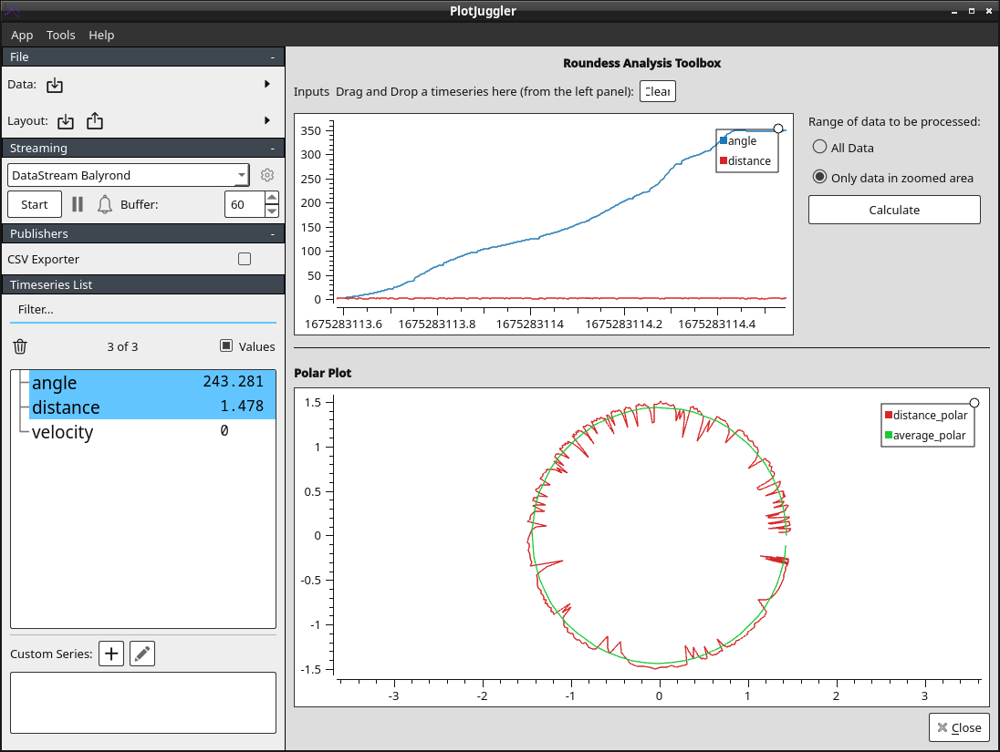

# Balyrond - The open source Roundness Tester project

## About

This repository exists to support the idea of an open souce
[roundness](https://en.wikipedia.org/wiki/Roundness) analyzer. By
roundness, we mean in the 
[GT&D Circularity](https://www.gdandtbasics.com/circularity) sense.

The typical setup involves a high-precision way to spin the object
being inspected (spindle). The data acquisition component is two
pieces: a way to tell where on the object we are measuring (encoder)
and a fixed distance measurement device. The distance transducer is
preferrably a capacitive sensor, but could be inductive, direct, or laser.

Commercial products for doing very precise inspection are available,
but are very expensive. This repository provides the hardware and software
building blocks, along with some documentation so you can build your
own setup. The license is open, so use what you want.

The main components are:

### Two PlotJuggler Plugins

[PlotJuggler](https://plotjuggler.io/) is an open source realtime
plotting program. Included in this repo are two plugins:

- Data Streaming of roundness data from a serial port
- Roundness analysis toolbox for analyzing the data

### Firmware examples

The current target platform is a Seeeduino XIAO running micropython.

### Hardware schematics

Wiring diagrams and part numbers.

## Brief Tutorial: Looking at data

First, review the general [PlotJuggler tutorial](https://facontidavide.github.io/PlotJuggler/visualization_howto/index.html).

In the test folder, there is a csv file with some sample "roundness"
data.

In PlotJuggler:

- Open the file by clicking the Data button at the top left.
- In the popup, select "Use row number as X axis"
- Click "Ok"
- Go to Tools -> Roundness Analysis
- Drag the `angle` and `distance` fields into the top plot viewer
- Click "Calculate"

## Building the Plugins

In general, follow the prerequisites for PlotJuggler.

### Prerequisites (Windows)

- git
- Visual Studio 2019 (v16)
- vcpkg
- Qt 15

### Instructions: Windows standalone

1. Clone this repo: `git clone <repo-url> --recurse-submodules`
2. Fix the path to vcpkg in `build-win32.bat`
3. Run `build-win32.bat`
4. The `install/bin` folder is the standalone application folder

### Instructions: Linux

1. Clone this repo: `git clone <repo-url> --recurse-submodules`
3. Run `./build-linux.sh`
4. The `install/bin` folder is the standalone application folder

### Instructions: Mac

1. Clone this repo: `git clone <repo-url> --recurse-submodules`
3. Run `./build-mac.sh`
4. The `install/bin` folder is the standalone application folder
