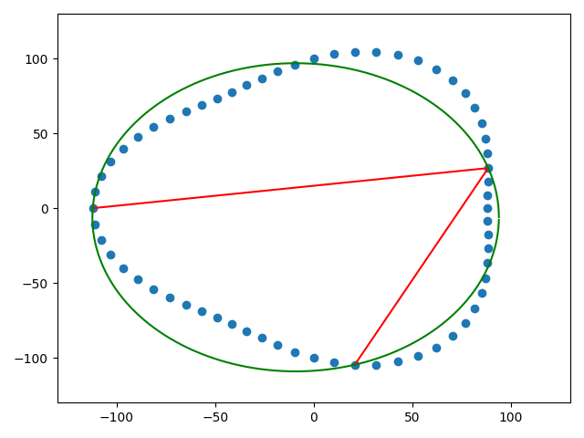

# MIC/MCC/MZC Sample Programs

## Maximum Inscribed Circle (MIC)

`mic.py` contains the algorithm documented in the paper "A Quick
Algorithm of Maximum Inscribed Circle Method for Evaluation of the
Roundness Error". It is not meant to be efficient, the demo program
was just a way to prototype the solution and wrap my head around the
algorithm.

